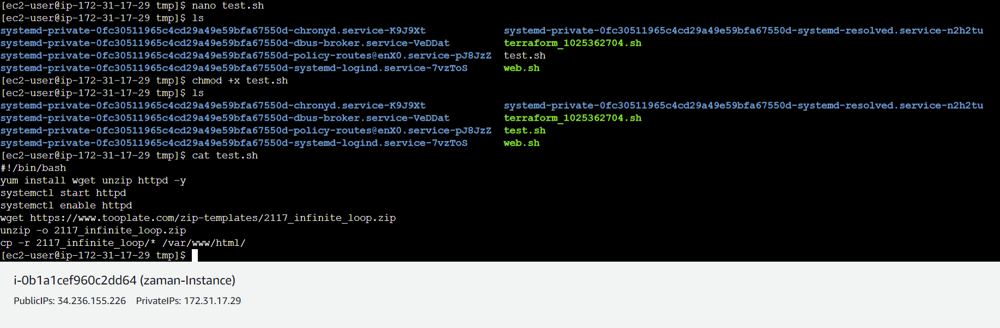

# What we will achieve:

1.  Centralized Terraform State Management: Setting up an AWS S3 Bucket
    for Shared State Across Team Environments

2.  Run a web application in AWS VM using terraform

# Amazon S3

Store and retrieve any amount of data from anywhere

Amazon S3 (Simple Storage Service) in AWS offers a robust solution for
diverse storage needs. Its versatility makes it a cornerstone for
various use cases, such as serving as a reliable backup and restore
system, hosting static websites, distributing content globally through
integration with Amazon CloudFront, and acting as a central data lake
for analytics services

We will utilize S3 bucket to maintain terraform state for all team
members.

Project source code Github:
<https://github.com/hasanashik/terraform_aws/tree/main>

**Repository introduction:**

In *terraform_aws* directory we have 4 terraform files:

1.  backend.tf: S3 bucket terraform state maintanance

2.  instance.tf: Defines required resources of AWS

3.  providers.tf: Defines cloud provider

4.  vars.tf: Defines variables used in other terraform files.

Generating an RSA key with default settings:

We have to create a SSH key pair which will be used at time of creating
resources in AWS. To do so we need to run: ssh-keygen

This will create public and private key files.

**[Part 1 Steps:]{.underline}**

1.  **Create S3 bucket and directory in bucket**

2.  **Write backend.tf**

3.  **Terraform apply**

**Creating S3 bucket and directory in bucket:**

Go to: Amazon S3 \> Buckets \> Create bucket

Give a bucket name and click create bucket.

Create Security group by adding inbound rules. For test purpose we are
allowing all HTTP, TCP connections for IPv4 and IPv6:

Copy security gruoup ID to instance.tf file.

Update AMI in var.tf as per your zone available AMI. Here we are using
Amazon Machine Image (AMI)

Now create a S3 bucket:

Create a repository inside bucket:

Update backend.tf values.

Update providers.tf file as per your access key or you can do *[aws
configure]{.underline}* in cli.

Now let us initialize terraform to create state file in the folder of S3
bucket.

Run *[terraform init]{.underline}* or *[terraform init
-reconfigure]{.underline}*

Do terraform validate, fmt and plan

And finaly terraform apply.

In the bucket now we can see that the state is updated:

**Part 2: Run a website inside AWS EC2 VM using terraform**

Our part 1 terraform scripts already pushed the required bash script to
run web application inside the VM. Now we should have our web
application running at public ip of VM.

In our case we needed to manually run the web.sh file after copying its
content to a new manual script file.

